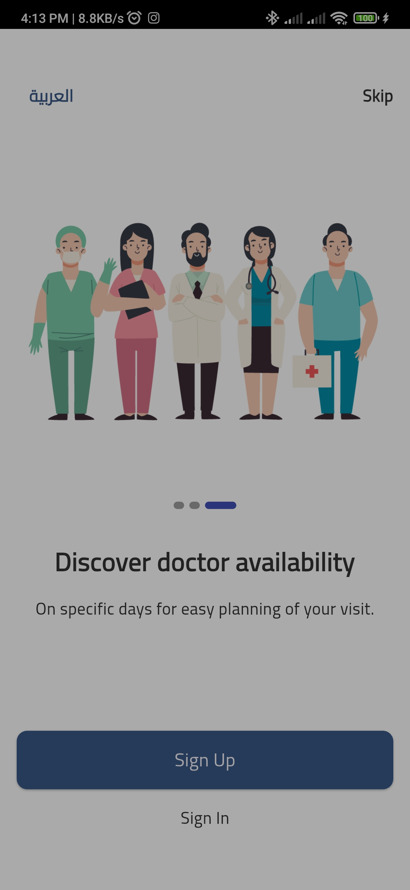
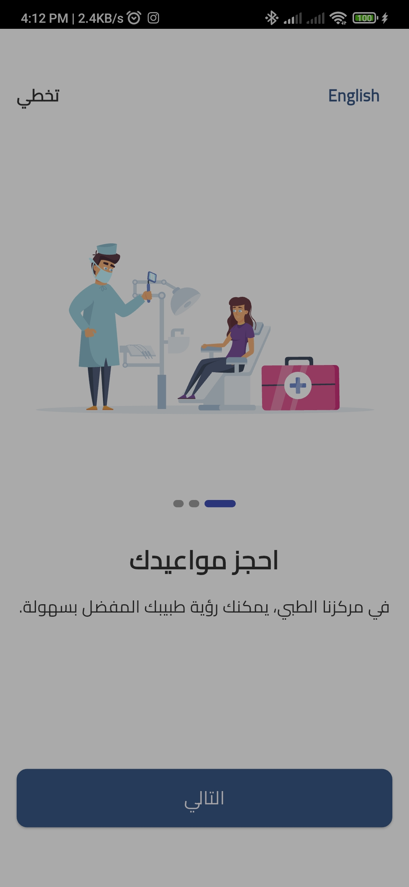
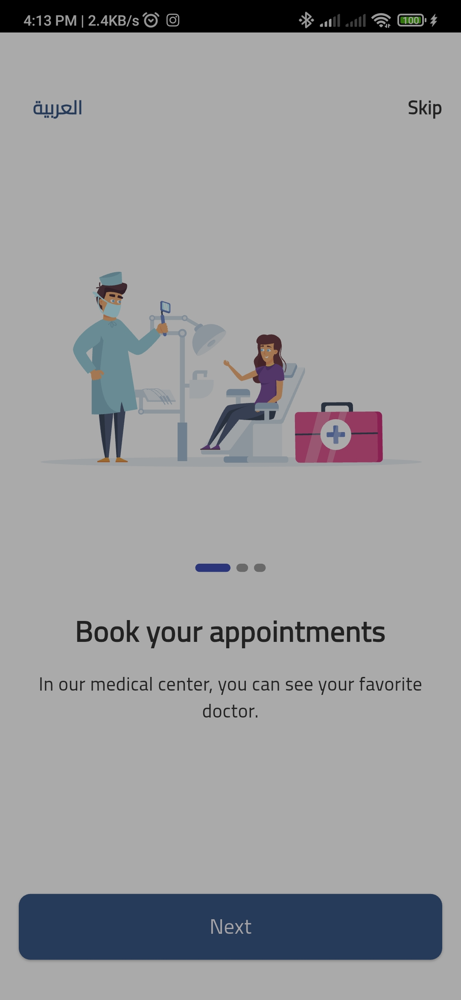
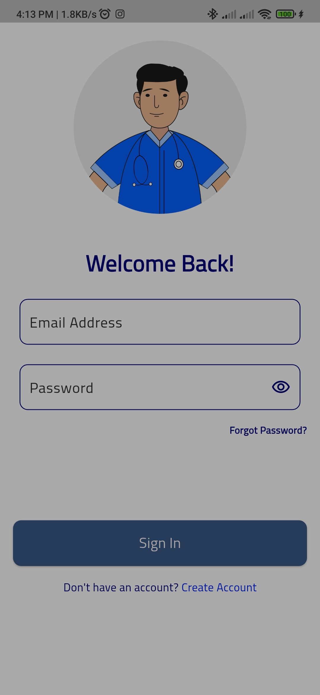
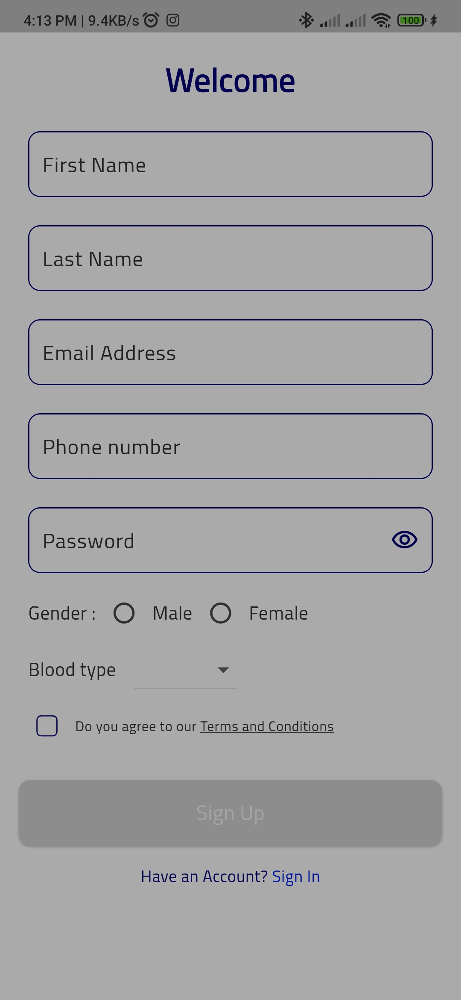
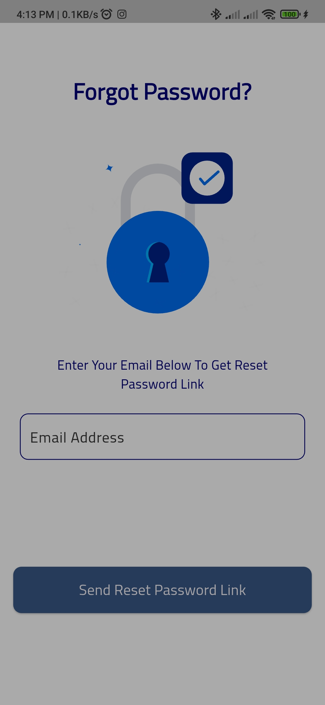
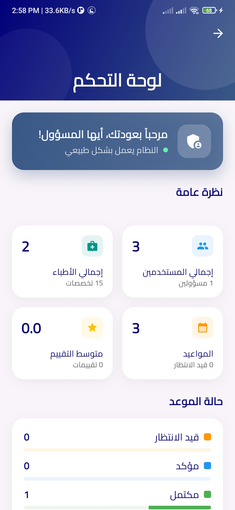
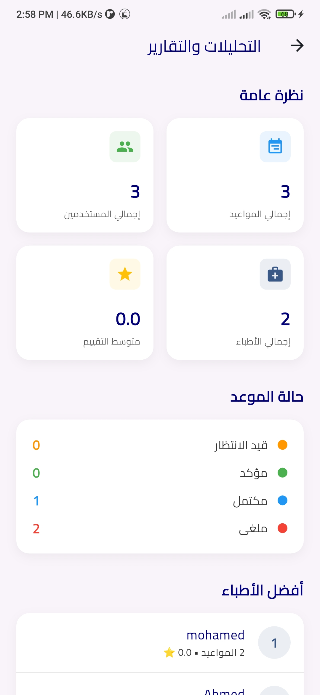
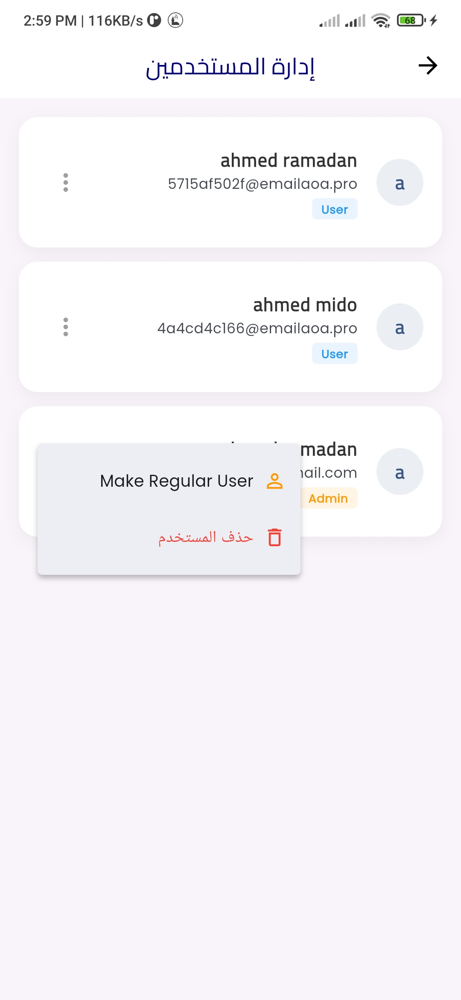

# 🏥 Medical Center - Flutter Healthcare Application

A comprehensive Flutter-based healthcare management application with Firebase backend integration. The app provides seamless user authentication, appointment booking, doctor discovery, and a professional-grade administrative dashboard.

**Current Version:** 1.2.0  
**Flutter SDK:** >=3.1.3 <4.0.0  
**Repository:** [ahmedramadan-20/medical_center](https://github.com/ahmedramadan-20/medical_center)

---

## 📋 Table of Contents

- [Features](#features)
- [Screenshots](#screenshots)
- [Project Architecture](#project-architecture)
- [Project Structure](#project-structure)
- [Development Workflow](#development-workflow)
- [Key Technologies](#key-technologies)
- [Installation & Setup](#installation--setup)
- [Firebase Integration](#firebase-integration)
- [License](#license)

---

## ✨ Features

### 🛡️ Admin Dashboard (New)
*   **Real-time Statistics**: Live monitoring of total users, doctors, appointments, and user reviews.
*   **Appointment Analytics**: Visual status breakdown (Pending, Confirmed, Completed, Cancelled) with progress indicators.
*   **Quick Action Hub**: 8 specialized management tiles for streamlined operations:
    - Doctor & Specialty Management
    - Appointment Control
    - User Role management (Admin/User)
    - Blood Donation Records
    - Review Moderation
    - System Notifications & Analytics
*   **System Integrity**: Integrated `LoggerService` for granular debugging and system monitoring.

### 👤 User Features
*   **Smart Discovery**: Browse doctors by specialty with real-time Firestore-backed filtering.
*   **Intelligent Booking**: Real-time availability checks with support for "Today" bookings.
*   **Patient Profiles**: Comprehensive booking system for self or family members.
*   **Secure Auth**: Firebase-powered Sign Up/Sign In with password recovery and robust profile management.

### 🛠️ Technical Excellence
*   **Clean Architecture**: Strict separation of concerns (Presentation, Domain, Data, Core).
*   **Feature-Based Folder Structure**: Highly scalable organization of modules.
*   **Multi-language**: Seamless English (en) & Arabic (ar) support with RTL layout handling.
*   **V2 Navigation**: Modern bottom navigation utilizing `persistent_bottom_nav_bar_v2`.
*   **Performance**: Lazy-loaded lists, image caching, and optimized Firestore listeners.

---

## 📸 Screenshots

### 🔑 Authentication & Onboarding
<div align="center">

| Splash Screen | Onboarding (EN) | Onboarding (AR) |
|:---:|:---:|:---:|
|  |  |  |

| Onboarding 3 | Login | Sign Up |
|:---:|:---:|:---:|
|  |  |  |

| Forget Password |
|:---:|
|  |

</div>

### 🛡️ Administrative Dashboard
<div align="center">

| Admin Dashboard | Appointment Analysis | User Management |
|:---:|:---:|:---:|
|  |  |  |

</div>

---

## 📹 Application Walkthrough

<div align="center">
  <video src="assets/videos/walkthrough.mp4" width="100%" controls>
    Your browser does not support the video tag.
  </video>
</div>

[Click here to watch the full walkthrough video](assets/videos/walkthrough.mp4)

---

## 🏗️ Project Architecture

The project follows **Clean Architecture** with **BLoC/Cubit** for state management:

```
medical_center/
├── Presentation Layer    (UI, Pages, Widgets, BLoCs/Cubits)
├── Data Layer           (Models, Repositories, Data Sources)
├── Domain Layer         (Entities, Use Cases, Repository Interfaces)
└── Core Layer           (Theme, Services, Utilities, Routes, Logging)
```

### Design Patterns Used
- **BLoC/Cubit** - State management
- **Repository Pattern** - Data abstraction
- **Service Locator (GetIt)** - Dependency injection
- **Go Router** - Navigation
- **Firebase** - Backend services

---

## 📂 Project Structure

```
lib/
├── main.dart                          # App entry point & Initialization
├── core/                              # Shared singleton services & utilities
│   ├── routes/app_router.dart         # Go Router declarative navigation
│   ├── theme/                         # Centralized Material 3 theming
│   └── services/logger_service.dart   # Structured application logging
├── features/                          # Feature-contained modules
│   ├── admin/                         # Admin dashboard & management logic
│   ├── home/                          # Doctor discovery & patient home
│   ├── auth/                          # Authentication & profile management
│   ├── appointments/                  # Booking & scheduling system
│   └── blood_type/                    # Blood record registry
└── l10n/                              # Localization delegates (AR/EN)
```

---

## 🛤️ Development Workflow

The repository adopts a **Professional Git Workflow**:

*   **`master`**: Production-ready code only.
*   **`dev`**: The main development branch for integration.
*   **`feat/*`**: Feature-specific branches (e.g., `feat/admin-dashboard`) for isolated work.

Standard Commit Convention: `type(scope): description` (e.g., `feat(admin): implement dashboard analytics`).

---

## 📦 Key Technologies

*   **State Management**: `flutter_bloc`
*   **Dependency Injection**: `get_it`
*   **Navigation**: `go_router` (V2)
*   **Backend**: `firebase_auth`, `cloud_firestore`, `firebase_core`
*   **UI/UX**: Custom Glassmorphism, Material 3, `google_fonts` (Cairo/Poppins)
*   **Logging**: `LoggerService` based on `dart:developer`

---

## 🚀 Quick Setup

1. **Get Packages**: `flutter pub get`
2. **Generate L10n**: `flutter pub run intl_utils:generate`
3. **Run App**: `flutter run`

---

## 📝 License

Maintainer: [ahmedramadan-20](https://github.com/ahmedramadan-20)  
**Last Updated:** January 2026  
**Status:** ✅ Production Ready | High-Performance
